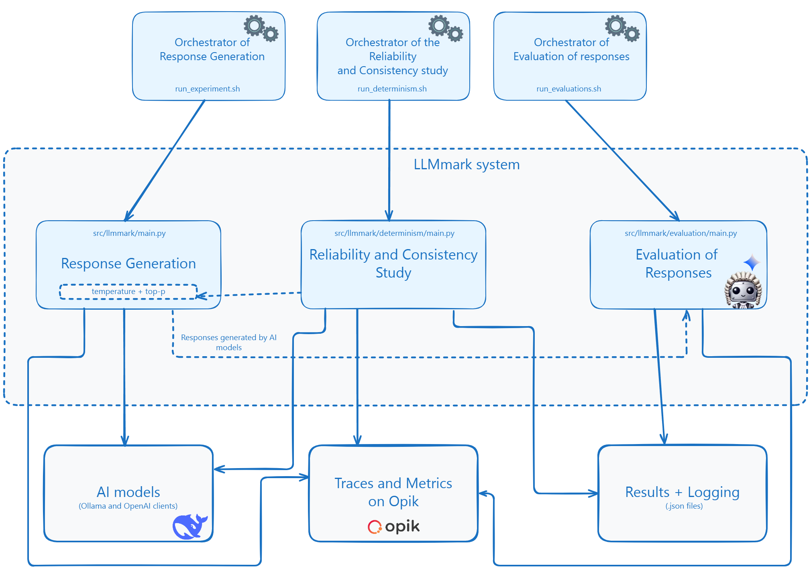

# 📘LLMmark
LLMmark is a system designed to automate the execution and evaluation of Generative Artificial Intelligence (AI) models on Edge Devices. Its main objective is to analyse the feasibility of running Generative AI models on resource-constrained devices to solve exams and exercises of the Computer and Networks course of the Computer Engineering degree at the University of Oviedo.

This study is based on local models that are supported using the [Ollama](https://github.com/ollama/ollama) client and online models through the [OpenAI API Python library](https://github.com/openai/openai-python).




## ✍️ Authors

**Coral Izquierdo Muñiz** - [GitHub](https://github.com/coral2742) [LinkedIn](https://www.linkedin.com/in/coral-izquierdo/) 
** Julio Molleda Meré - [Tenured Associate Professor of Computer Architecture and Technology
Department of Computer Science and Engineering - University of Oviedo]

## 🚀 Getting Started

### 🔧 Prerequisites
To run this project, you need to set up several environment variables, including API keys for online LLM providers and credentials for Opik.

```bash
export GEMINI_API_KEY=<YOUR_API_KEY_HERE>
export GOOGLE_API_KEY=<YOUR_API_KEY_HERE>
export OPENAI_API_KEY=<YOUR_API_KEY_HERE>
export OPIK_API_KEY=<YOUR_API_KEY_HERE>
export OPIK_WORKSPACE=<OPIK_WORKSPACE_NAME>
export COMET_WORKSPACE=<OPIK_WORKSPACE_NAME>
```
source ~/.bashrc

👉 Note: The `llmmark/clients/ollama_client.py` includes logic to check for and pull models if they are not found using Ollama.

### 📦 Installation
```bash
git clone https://github.com/jmolleda/LLMmark.git
cd LLMmark
pip install -r requirements.txt
```


### ▶️ Running the Project

LLMmark provides scripts to run experiments and evaluations, orchestrating the different phases of the methodology:
- `run_experiments.sh`: Executes the Response Generation phase. This script parametrizes the models, exercises, prompting techniques, and languages to be used for response generation. Executions are logged to your Opik project under the name `LLMmark_response_generation`.
- `run_determinism.sh`: Executes the Reliability and Consistency Study. This script is crucial for determining the optimal temperature and top-p parameters for models, evaluating their consistency and reliability. Traces are logged to the Opik project `LLMmark_determinism`.
- `run_evaluations.sh`: Carries out the Evaluation of Generated Responses. This script uses heuristic metrics like ROUGE and the LLM-as-a-Judge technique (implemented with G-Eval) to assess the quality of responses. Evaluation results are logged to the Opik project `LLMmark_evaluation`.

#### Command-line arguments
You can also run the main modules directly with arguments for more granular control. For example:
```bash
# Response Generation
python -m llmmark.main \
    --question-type open_answer \
    --exercise-folder exam_01_oa \
    --language en \
    --model-source local \
    --model-id "deepseek-r1:1.5b" \
    --prompting-technique R1 \
    --num-runs 5 \
    --temperature 0.0

# Reliability and Consistency Study
python -m llmmark.determinism.main \
    --question-type open_answer \
    --exercise-folder exam_01_oa \
    --language en \
    --model-source local \
    --model-id "deepseek-r1:1.5b" \
    --prompting-technique R1 \
    --num-runs 5 \
    --temperature 0.0

# Response Evaluation
python -m llmmark.evaluation.main \
    --run-folder run_001 \
    --model-id "deepseek-r1:1.5b"
```

### ⚙️ Configuration with config.yaml
You can configure project settings using the file `config.yaml` in the project root including:
- Ollama and OpenAI Model Definitions: Specify display names, model IDs, base URLs, and API key environment variables.
- Question Types: Define the supported question types (open_answer, multiple_choice).
- Folder Paths: Customize where data, questions, and experiment results are stored.
- Prompting Techniques: Select from predefined strategies like Standard, Reasoning, and Definition-based prompts, combined with Zero-shot or Few-shot examples, and Task-Oriented or Role-Oriented approaches.
- Evaluation Settings: Configure the judge model used for G-Eval and output file names.


### 📝 Prompt Management with prompts.yaml
You can define the prompts to use in the project modifying the `prompts.yaml` file. It defines the system and user prompts for various prompting techniques and evaluation criteria in multiple languages (English and Spanish). These prompts are automatically registered with Opik's prompt library for version control and centralized management.

Example of prompt file structure:
```bash
en:
  # Base prompts for question types
  open_answer: |
    Provide an answer to the following question.
  multiple_choice: |
    You must respond with exactly one of the following options: [a], [b], [c], [d], [e] or [f].
    # ...
  
  # Prompting Techniques (S1, R1, D1, etc.)
  S1:
    system: ""
    user: |
      Do not include any additional text or explanations in your response, just the answer to the question.
      Question: {question}"
```

### 📊 Tracing and Evaluation with Opik
This project is deeply integrated with Opik for end-to-end LLM observability.
- Automatic Tracing: All LLM calls made during experiment runs (llmmark.main) and determinism tests (llmmark.determinism.main) are automatically logged as traces to Opik. Each trace includes input prompts, LLM responses, response times, model information, and custom metadata.
- Response Generation Traces: Found in the LLMmark_response_generation project on Opik.
- Determinism Traces: Found in the LLMmark_determinism project on Opik.
- Automated Evaluation: The evaluation script (llmmark.evaluation.main) calculates ROUGE, content inclusion (Contains), and GEval scores for each model's response. These scores are logged as feedback scores to the corresponding spans in Opik, within the LLMmark_evaluation project.
- Opik Prompt Library: Prompts defined in prompts.yaml are automatically registered with Opik's prompt library for versioning and centralized management.

To view your experiment traces and evaluation results, simply navigate to your Opik workspace on Comet.com after running the scripts.

### Open-answer question file

question.txt

```txt
What is the representation of the number 61 in natural binary?

<00111101>
```

### Multiple-choice question file

question.txt

```txt
What is the representation of the number 61 in natural binary?
[a] 00111110000  
[b] 00111101  
[c] 0011110110  
[d] 43h  
[e] 10101110  
[f] 101001001  

<b> 
```

### 📁 Output Files
Generated responses and statistics are saved locally in the data/runs folder, organized by run ID and model ID.

run_1/gemma3n:e2b/question_01.json

```json
[
  {
    "average_response_time (s)": 28.369
  },
  {
    "question": "¿Qué siglas se utilizan habitualmente para referirse a las redes de área local?\n\n[a] WAN\n[b] MAN\n[c] SAN\n[d] PAN\n[e] VPN\n[f] LAN",
    "answer": "[f]",
    "correct_answer": "f",
    "raw_answer": "[f]\n",
    "model": "Gemma3n:e2b",
    "response_time (s)": 28.369
  }
]
```

run_1/gemma3n:e2b/stats.json

```json
{
    "num_llm_calls": 10,
    "average_response_time_s": 6.911,
    "total_response_time_s": 69.105
}
```


# 📄 License

This project is licensed under the MIT License - see the [LICENSE](LICENSE) file for details.